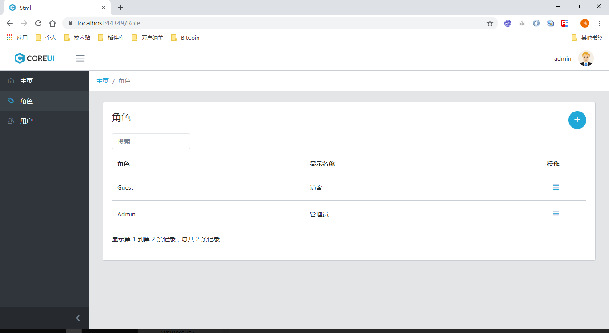
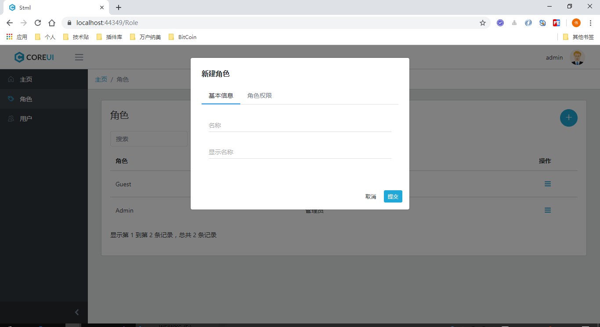
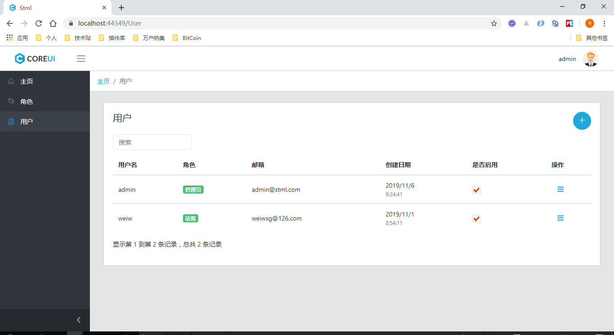
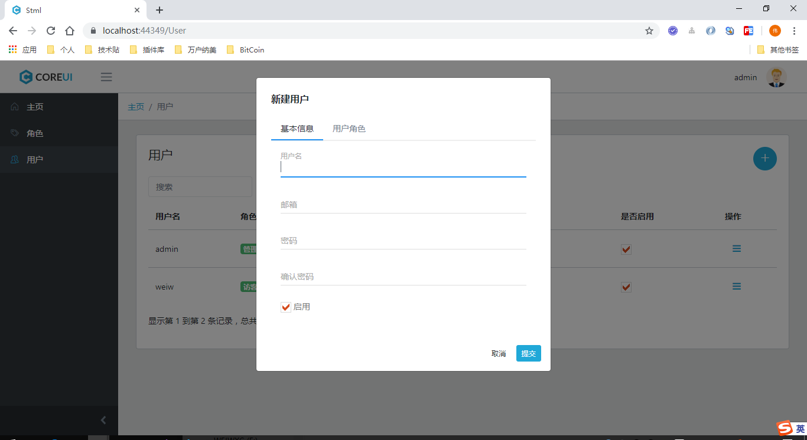

# Stml
Skip To My Lou

## 数据库配置

* 修改数据库连接

```json
// appsettings.json
"ConnectionStrings": {
    "Stml": "Data Source=(localdb)\\MSSQLLocalDB;Database=Stml;Integrated Security=True;"
  },
```

* 生成数据库

工具 -> NuGet包管理器 -> 程序包管理器控制台

```csharp
PM> Update-Database
```

## 菜单配置

在 Stml.Web 项目下的 Startup/Navigations 文件夹中：
* PageNames.cs： 配置菜单名称
* StmlNavigationProvider.cs： 配置菜单项

## 权限配置

在 Stml.Web 项目下的 Startup/Permissions 文件夹中：
* PermissionGroupNames.cs: 配置权限组
* PermissionNames.cs: 配置权限名称
* StmlPermissionProvider.cs: 配置权限项
* StmlUserClaimsPricipalFactory.cs: 权限声明解析

## 运行预览

登录账户：administrator / 123qwe

1. 角色列表



2. 新建角色



3. 用户列表



4. 新建用户


